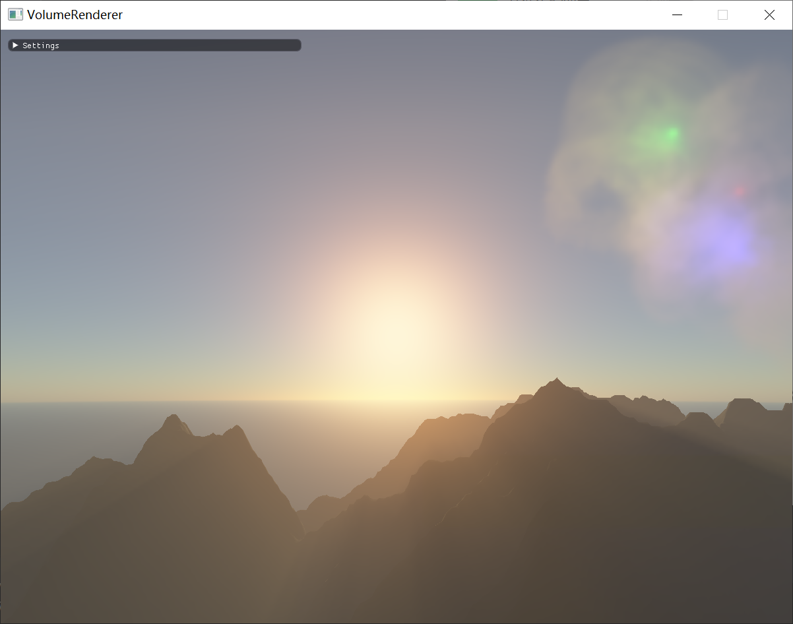
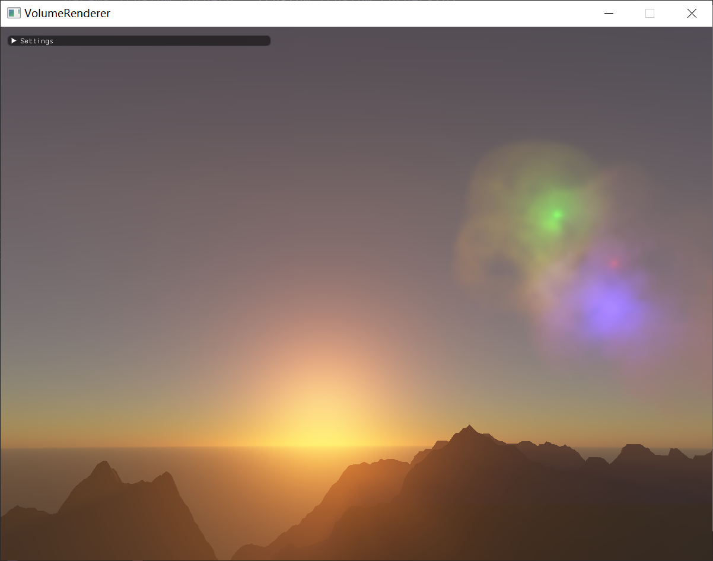
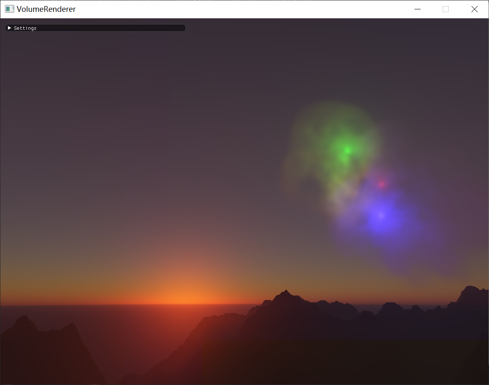
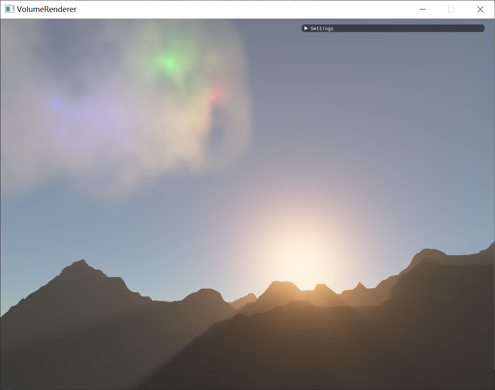
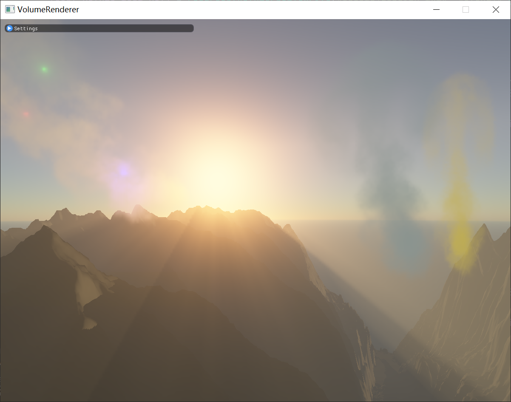

# VolumeFog
本项目基于C++和OpenGL，主要实现了大气渲染和体积雾渲染，并且两者的散射保持一致性，
可以添加自定义的局部体积雾和点光源。
## Features
* Atmosphere Render
* Local and Global Volumetric Fog
* Volumetric Shadow
* Virtual Texture
* Tile Based Lighting
* TAA

## Screenshots

## Compile && Run
使用 `git clone https://github.com/wyzwzz/VolumeFog --recursive`
下载到本地后直接编译即可，运行目录设置为工程所在目录。

注意需要性能比较强的显卡才可以运行，否则可能十分卡顿。

## Implementation Details
大气和体积雾的渲染模型是十分相近的，均属于体介质参与的散射，
大气渲染需要考虑两种不同的散射模型，瑞利散射和米尔散射，
前者对应半径与光波长差不多的微粒，而后者则对应大分子，如水分子和尘埃等，
因此体积雾实质上属于米尔散射的一种，从而两者可以使用相同的度量单位，
可以结合在一个共同的框架中，而这个框架则是`froxel`。
将视锥体所在的空间划分为`froxel`，用一个三维纹理存储，
每一个`froxel`代表从该处空间单位到视点的特定属性，如衰减度和累积`in-scattering`，
而计算这些属于则需要通过查表或者纹理采样，对于大气渲染，需要采样预计算的二阶及
以上的多次散射，对于体积雾渲染，则需要采样存储了体积雾属性的三维纹理，
该三维纹理同样代表视锥体空间范围，每次需要先对其进行填充，即根据空间位置关系，
将视锥体范围内的局部体积雾属性填充到对应的三维纹理处。
全局的体积雾只有一个，每次可以直接填充，而局部体积雾可能有多个，
无法预分配纹理，或者说这样子做的效率很低，因此将局部体积雾属性所代表的纹理
存储在虚拟纹理中，提升算法的鲁棒性。

点光源采用了常用的`Tile Based Lighting`进行加速。
为了提升局部体积雾的渲染质量，加了一个`TAA`流程，可以一定程度上减轻局部雾渲染时的失真走样。

整个算法流程的瓶颈主要在于`froxel`的计算，
`froxel`的计算涉及到了较多的采样操作，而`froxel`存储在三维纹理中，
其数量较多，同时三维纹理的尺寸会显著地影响到局部体积雾渲染的质量，
因此存储`froxel`的三维纹理尺寸需要特别关注和设置。
一点属于我自己的猜测，每一个`froxel`的计算涉及到了较多的访存操作，
主要是对二维和三维纹理的采样，可能超出了纹理缓存的上限，使得局部缓存失效，
从而导致每次很大的访存带宽压力和耗时。

## References
[A Scalable and Production Ready Sky and Atmosphere Rendering Technique](https://sebh.github.io/publications/egsr2020.pdf)

[Physical Based and Unified Volumetric Rendering in Frostbite](http://advances.realtimerendering.com/s2015/index.html)

[Creating the Atmospheric World of Red Dead Redemption 2](http://advances.realtimerendering.com/s2019/index.htm)
