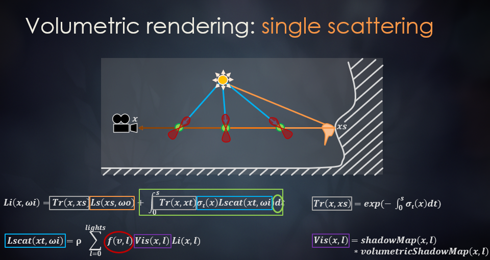
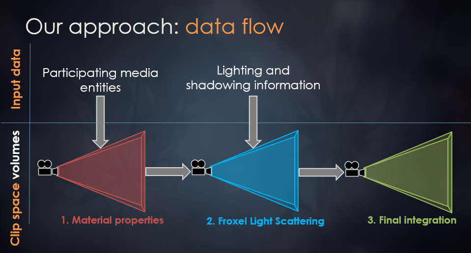
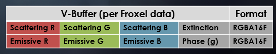
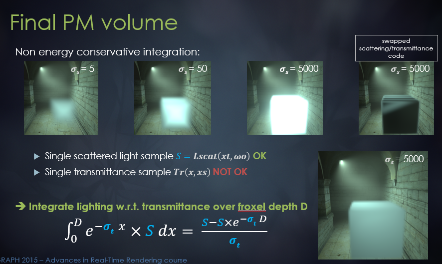

## Physically Based and Unified Volumetric Rendering in Frostbite

这篇文章发表在2015年，讲了在寒霜引擎中一种统一的体渲染框架，作者大佬其实在之后2020年提出了一种实时的大气渲染框架，其中的大气透视表的思路就是基于本文，因此在阅读的时候，感觉到很多熟悉的地方，不过还是有一些不是很清晰的地方，在之后实现的时候，应该会搞清楚，当然也有一些对我来说熟悉又陌生的概念，比如volumetric shadows，在实现大气云的时候其实就想过怎么实现云的阴影，以及clip map，耳熟能详，但是并不清楚具体的实现和作用。在此记录下这篇文章讲到的内容。

### 体介质渲染方程

一个点x的入射光$L_i(x,\omega_i)$来源于两部分，
第一部分是场景中点xs朝(xs,x)方向的发射光(包括了点xs的自发光和反射光)经过路径(xs,x)衰减后的radiance，
第二部分是路径(xs,x)当中每一点xt朝着x方向的inscattering经过路径(xt,x)后衰减的radiance，如果只考虑单次散射的话，inscattering来源只需要考虑光源，而从光源到xt这一点还需要考虑衰减、visibility factor，以及散射系数$\sigma_s$和相位函数计算的$\rho$。

### clip space volume
对屏幕进行tile划分后，再沿着z轴切分，相当于把视锥体划分成了网格，不过每个格子代表的世界空间大小不同，而且不是规则的网格，这里可能有一个优化的点，z轴的划分不是均匀的。
在寒霜中，因为是tile-based deffered架构，每个tile的大小是16x16，因此对视锥体的划分，xy方向的尺寸一般是8或者4。
这样子划分，其实是为了之后用一个三维纹理来存储每一个格子对应的一些属性值，即我们把视锥体即世界空间划分成多个格子，每一个格子的属性用一个纹素来表示，一般体渲染用于雾和云之类的，边界都是模糊的，没有具体确定的外形，因此用一个低分辨率的三维纹理比如240x135x64就可以很好的表现1080p下的体积渲染。

### data flow

#### material properties
这一部分主要是把场景中与视锥体相交的体介质属性添加到三维纹理中，因为体介质一般是用一个包围盒代表的，一个场景中可以有多个体，渲染的时候只需要关注视锥体范围内每个格子代表的volume properties。因此这个步骤大概是在计算着色器中，获取每一个格子对应的体属性并将其存储到vbuffer中（其实就是三维纹理，与gbuffer对应）。

#### froxel light scattering
计算每一个格子的inscattering之和，因为要支持多个多种光源，这一步可能可以和tile based的light list进行结合，而且要计算从光源到第一次散射点中间的shadow factor，包括regular shadow map和volumetric shadow map。
以及一个$\sigma_t$湮灭系数，这里为了节约内存直接假设其与波长无关。
还提到了可以通过时间降噪，每帧采样纹理时加入随机偏移，以及重投影进行blend。

#### final integration
这一步是要进行ray marching的，从而计算出每个格子贡献到相机的radiance，在前面我们已经存储了每个格子的inscattering，而从格子处到相机光线还会因为体介质而衰减。因此从相机处开始ray marching，记录累积的transmittance，计算从相机到该格子处累计的inscattering之和，那么在实际渲染的时候，我们可以根据片段的xyz从三维lut中查表即可。
在这里它还提到了每个格子处采样一个inscattering是可以的，不会有明显的错误，
但是每一个格子采样如果用一个transmiitance替代会出现严重的能量不守恒现象，
即对于一个slice，不能用一个常量的transmitance替代，他给出了解析解。

