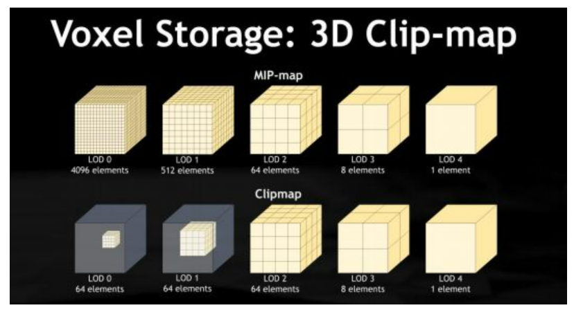
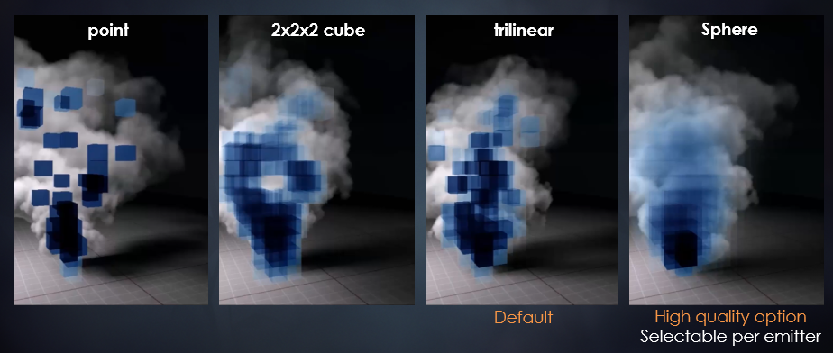

### clip map

clip map是一种类似于mip map的存储方式，以相机视点为中心建立一个包围盒，每个level只保存包围盒内部的信息，并且每个level实际代表的空间大小是不同的，离视点越远的场景的体素信息越粗糙。
相对于mip map来说，clip map其实是对mip map进行了clip，这是因为clip map的用途决定了在level比较小的时候，不需要存储那么多的信息（离相机远的部分），不过每一帧都要生成clip map，其实也是挺大的消耗。

### volumetric shadow map
用于实现体积云或者雾造成的阴影，比如开阔的世界下，因为大片的云遮挡住了阳光，导致地面的阴影。
为了生成这种阴影效果，类似于二维的shadow map，我们需要三维的volumetric shadow map，另外不同的是，shadow map我们只需要采样片段对应的深度信息进行比较即可，但是volumetric shadow map则是需要用ray marching进行计算shadow factor。具体而言，我们的volumetric shadow map存储的是空间中每一点的湮灭系数$\sigma_t$，因此当我们需要求场景中一点的volumetric shadow factor时，需要从这一点开始朝着光源位置进行ray marching，然后累积透射率，虽然原文没说，但是当透射率小于一定值时，应该会提前终止光线前进，当然ray marching的代价是很大的，体积阴影本来就是低频的，步数可以设置地较大，不过还有进一步的优化方法，
"A Fast Voxel Traversal Algorithm for Ray Tracing Amanatides&Woo, 1987"，因为clip map是规则、大小相同的网格，我们应该设置一个合适的步长使得每次采样点都是在网格的中心，即ray marching的采样步长应该不要小于网格一个体素的尺寸，这篇文章介绍了一个很好的基于DDA思想的方法。

### particle voxelization
还介绍了一个很有意思的算法，把空间中的体积雾给体素化，用一个半透明的小立方体表示，体介质的浓度越大，那么颜色越深越不透明。其实就是利用到了上面的clip map。
