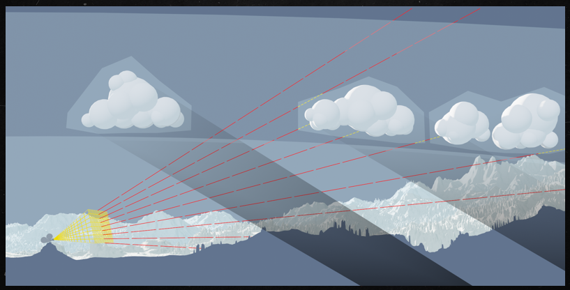
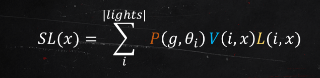
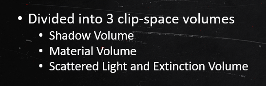

## Creating the Atmospheric World of Red Dead Redemption 2
大表哥2，很有名的游戏，画质十分逼真，据说逼近电影级别画质，当然首先得有个高档的显卡才能看到...
大表哥2的游戏剧情主要发生在十九世纪的美国野外，很多时候场景都是大自然。这篇文章看完后，概括一下它之所以画面这么有表现力真实感，主要是考虑了很多的体积光散射，比如考虑了真实的大气、体积云、体积雾的散射，这些在真实的大自然都是很重要的环境因素，如果可以很好地基于物理渲染，对于增强画面真实感和表现力是十分有力的，特别是特定情境下，比如清晨起雾的野外、烟雾渲染等。
不过通篇分享看下来，感觉并没有新的技术和创新点，用到的技术其实都是一些已经应用到工业界的算法，不过结合大表哥2游戏的具体要求，对相关技术做了适当的移植和适配，并根据具体的场景做了一些改进，或是把一些算法整合到完整的场景中，很多都是工程上的应用，但是能把所有算法整合到一起并且在质量和性能上做到平衡，也是一个很大的挑战。

### Data Model
这里一共介绍了三种模型，体积云、全局雾、局部雾

#### 体积云
主要是三维可平铺形状噪声和细节噪声，还有weather/cloud map、height map来表现具体的云的形状。

#### 全局雾 Fog Map
和体积云一样，整个场景只需要一个全局的fog map，代表场景中每一处雾的密度。因为全局雾是低频的，只需要用一张512x512 R11G11B10的二维纹理表示即可，每一点存储三个信息，雾开始的高度、雾消失的距离、雾的浓度，因此同一高度的雾浓度是相同的，限制在某一段高度中，但是可以通过平滑插值，在边界处可以得到平滑的雾浓度，这也与雾的低频特征相对应。

### 局部雾 Fog Volumes
全局雾一般主要是用于表现真实的雾现象，而局部雾或者说局部体积，可以表现出更多更丰富的现象，比如木头燃烧产生的烟雾、水烧开的蒸汽、以及爆炸产生的烟雾等，用于增强或者弥补全局雾无法达到的效果。
局部雾的轮廓一般是一个立方体或者一个球，但实际存储的都是三维纹理，因此如果是球，其实可以通过uv mapping转换。但不管是球还是立方体，都可以很高效地和视锥体求交，这一点很重要。三维纹理要存储的一般需要包括散射系数和吸收系数，大表哥2里给出的主要包括以下参数：
一个局部雾需要两个material volume，两个RGBA8U，
Volume A: RGB存储散射系数，A存储吸收系数
Volume B: R存储相位函数g，G存储全局发光强度，B存储环境光强度，A存储水滴密度
分享还提到了把32个体纹理存储到cluster grid中，这部分的实现细节之后再研究一下，猜测可能是和tile based lighting类似，把所有体纹理打包到一个大的virtual texture，然后使用一个数据结构记录每个包围盒对应的纹理位置，从而实现高效的更新和查询。

### Rendering

体渲染由froxel和ray marching共同组成，近距离使用froxel，当距离超过阈值时，使用ray marchinging，但两者共用一套光照和数据模型。

只考虑单次体积光的散射，这部分的L使用上述公式，涉及到了visibility、phase function和来自光源的luminance。这里提到的phase function的g项也是用到了henyey-greenstein，但是考虑到美术表现，g项的计算是通过加权blend的，美术可以调整g值达到不同的效果。关于visibility项，在寒霜里，需要用ray marching和clip map进行计算，这样对于局部的volume也可以表现出体积阴影，而在本文的分享中，不会考虑局部体积渲染造成的阴影，只考虑体积云造成的体积阴影。当然还有普通网格对象的阴影，其中terrian可以通过height map加速，它也讲到了局部多光源的阴影，这个之后再研究。
terrain的shadow map可以通过从一个主光源开始使用height map进行ray marhcing得到，同样cloud的shadow map也类似，只不过后者需要累积其湮灭系数，也可以提前终止ray marching。

类似于froxel的做法，第一步首先求得每个格子的visibility项，然后填充每个格子的meterial属性，最后计算出每个格子到相机的散射光。

关于远处ray marching的部分，暂时还没看懂，它讲了在一半的屏幕分辨率上做ray marching，但即便这样每个像素发射一根光线的代价还是非常昂贵，以一个2x2的像素块为tile，每一帧只取其中的一个像素进行ray maching，这样子相当于又降了一倍，实际上ray marching的像素只有原始分辨率的1/16，对于tile里的其余三个pixel，使用重投影进行重建，但是它提供的图我有点没看懂，最后绘制的时候进行上采样操作和clamp，其实和TAA有相似的地方。

